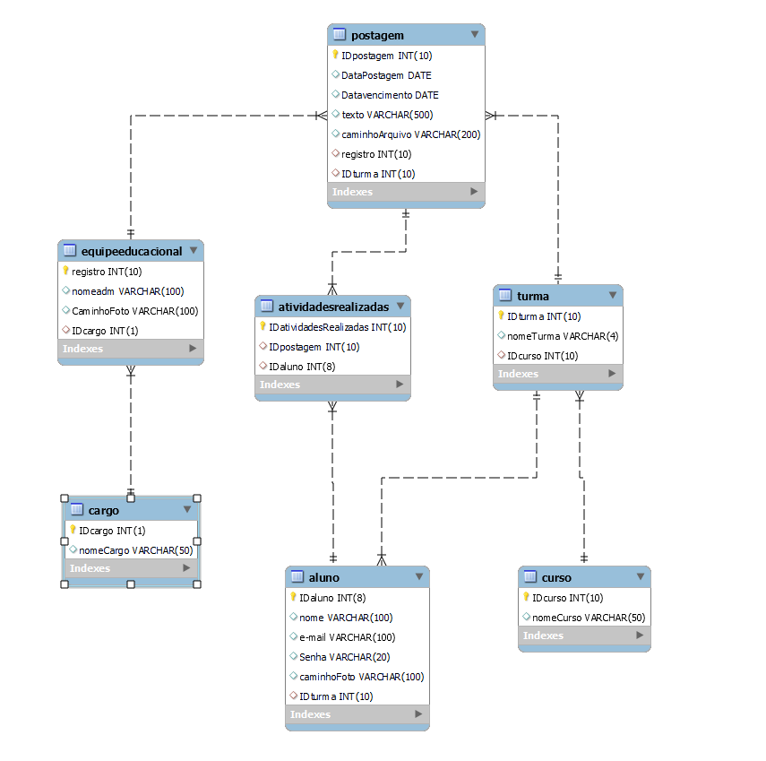

# TCC - 2023

Uma aplicação que servirá como quadro de avisos e centro de atividades para a escola.

## Autores

- [@RafaMatesco](https://github.com/RafaMatesco)

- [@enzoDante](https://github.com/enzoDante)

- [@Paulo-Renato-Durante](https://github.com/Paulo-Renato-Durante)

## Tema

Trazer facilidade para a comunicação entre a escola e seus alunos

## Objetivo pretendido

Desenvolver uma aplicação que possibilite a postagem de atividades e visualização da agenda sobre avisos e eventos relacionados ao colégio 
técnico UNIVAP.

## Justificativa

É notável que a quantidade de alunos deixando de entregar tarefas importantes sofreu um grande aumento durante a pandemia, pois a escola fez uso da  plataforma do Facebook para comunicação com seus alunos.

Essa plataforma já deixou de ser usada por muitos alunos, e mesmo quando usam, não são notificadas de uma nova postagem ou possuem dificuldade ao usá-la.

A nossa aplicação seria algo feito diretamente para a escola, o que ajudaria a manter o controle sobre ela e também substituiria os métodos atuais da escola se comunicar com os alunos, que é através do facebook e padlet.

Também podem ser adicionadas novas funções, as quais o facebook não faz uso hoje em dia, que é o envio de atividades por parte dos alunos, e também outras funções que podem ser discutidas e implementadas futuramente.

## Database

